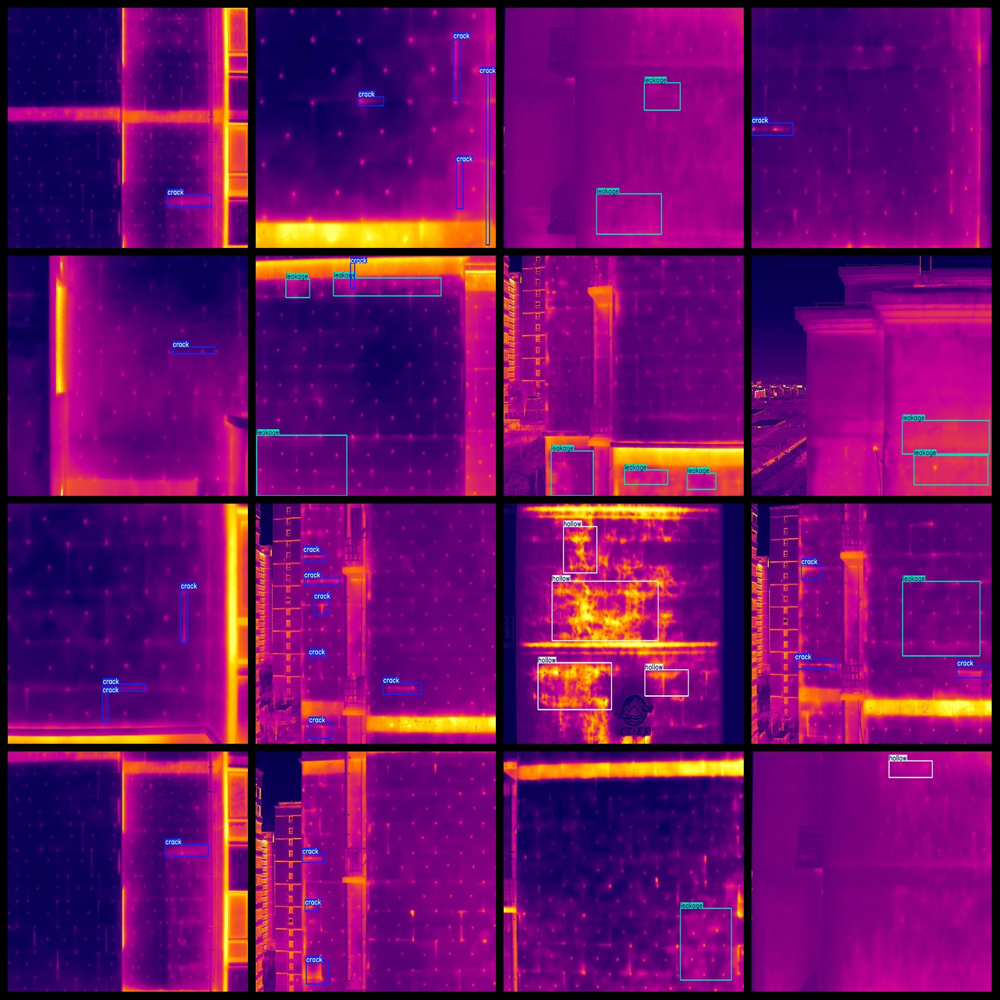
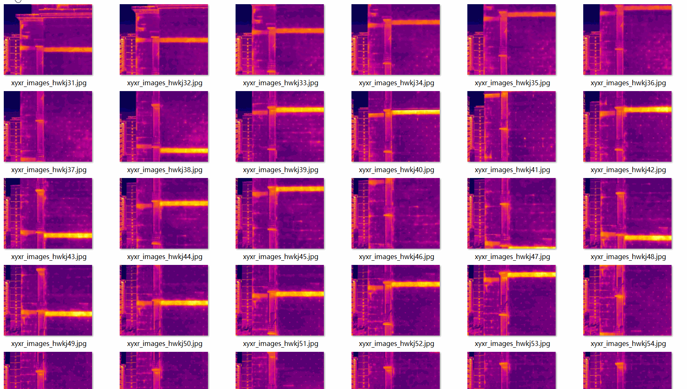

# Infrared Captured Building Defect Dataset 463 images VOC+YOLO format

The dataset consists of 463 images in the VOC+YOLO format, including JPEG images and XML and TXT files.

The JPEGImages folder contains a total of 463 jpg images.

The Annotations folder contains a total of 463 xml files.

The labels folder contains a total of 463 txt files.

There are a total of 4 label types: ["crack", "drop", "hollow", "leakage"].

The corresponding English names are ["Crack", "Drop", "Hollow", "Leak"].

The number of bounding boxes (boxes) for each label type is as follows:

- crack: 798 boxes
- drop: 46 boxes
- hollow: 196 boxes
- leakage: 493 boxes

The total number of bounding boxes is 1533.

The image resolution is clear, with a pixel count.

The images have not been enhanced.

The GitHub repository location is datasets_sl.

The shape of the labels is rectangular boxes, used for target detection recognition.

Important Notes: No guarantees are made regarding the accuracy or precision of the trained models or weight files. The dataset provides accurate and reasonable annotations only.

The annotation and picture situation is as follows:
## Images

---

Here is a pay link on Stripe (https://buy.stripe.com/3cs8yP7sY87d0vu9AB). Please contact me lonlonago@foxmail.com after funding $89, and I will send you a complete data files, thank you!

